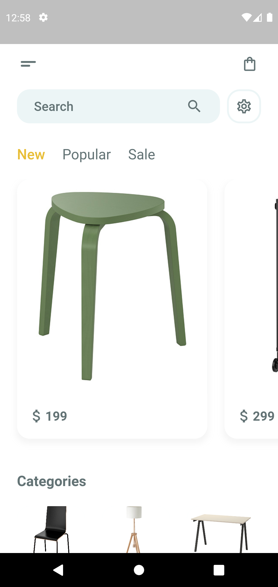
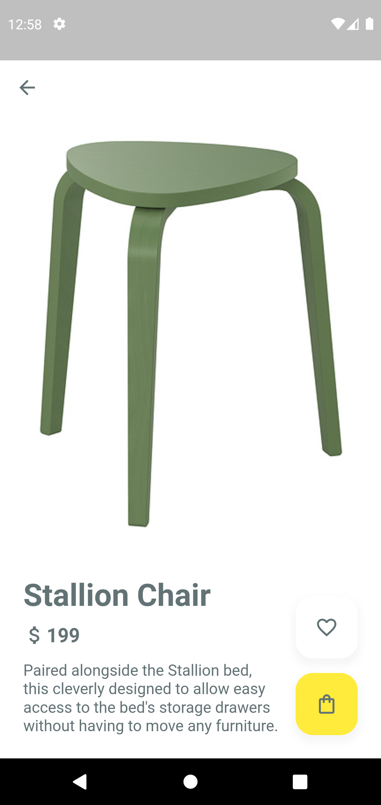

# Flutter UI

Furniture Catalogue App UI
- Design Credit: https://dribbble.com/shots/16582119-Furniture-Catalogue-
- Flutter 2.5.1
- [Apk File](apk)

Screenshot 1 | Screenshot 2
:-------------------------:|:-------------------------:
  |  

## Getting Started

This project is a starting point for a Flutter application.

A few resources to get you started if this is your first Flutter project:

- [Lab: Write your first Flutter app](https://flutter.dev/docs/get-started/codelab)
- [Cookbook: Useful Flutter samples](https://flutter.dev/docs/cookbook)

For help getting started with Flutter, view our
[online documentation](https://flutter.dev/docs), which offers tutorials,
samples, guidance on mobile development, and a full API reference.
